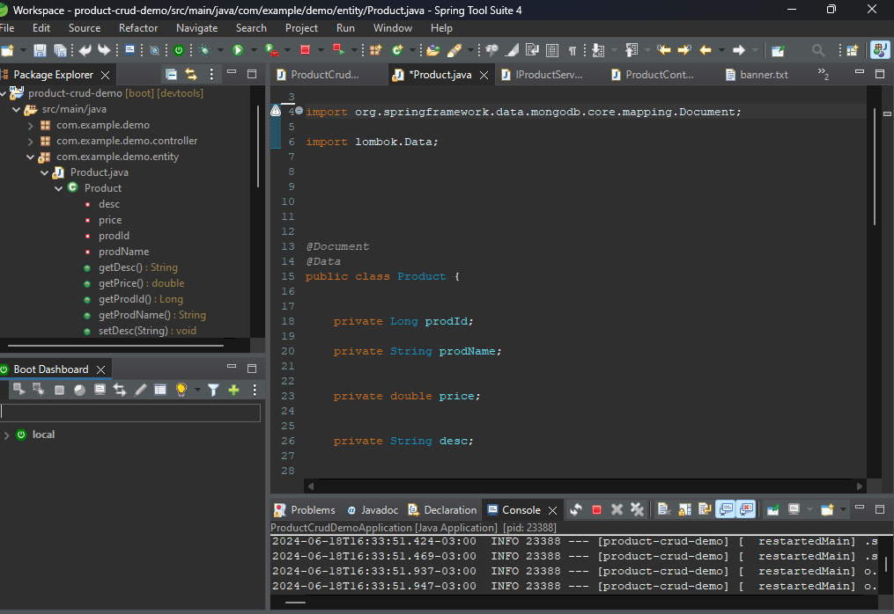
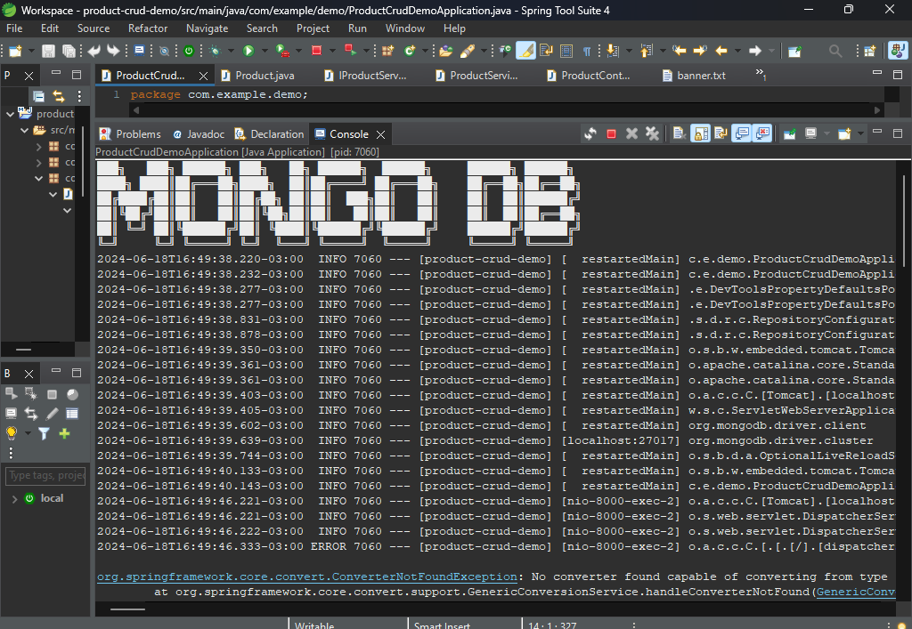

## Mongo_DB
___
Este Proyecto es para recordar que cuando se usa la BD Mongo, se debe colocar @Id en la PK para evitar que la BD coloque su id por defecto.
___

___

___

Causa este error, al no usar @Id  

___
